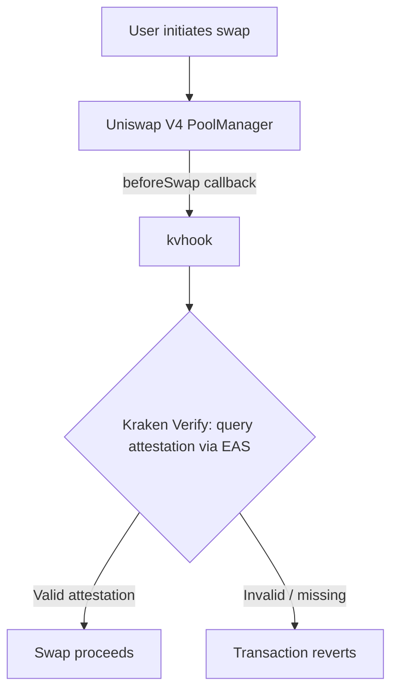

# kvhook

A Uniswap V4 hook that restricts swap access to users with valid [Kraken Verify](https://docs.inkonchain.com/build/verify) attestations, deployed on INK Network.

## Overview

kvhook integrates [Kraken Verify](https://docs.inkonchain.com/build/verify) with [Uniswap V4's hook architecture](https://docs.uniswap.org/contracts/v4/overview) to gate swap execution behind on-chain identity attestations. Only wallets that hold a valid attestation from Kraken (via the [Ethereum Attestation Service](https://easscan.org/)) can execute swaps. Liquidity provision remains unrestricted.

The hook implements a single permission, `beforeSwap`, which checks the sender's attestation before every swap. If the attestation is missing, expired, revoked, or otherwise invalid, the transaction reverts.

## How it works


```mermaid
flowchart TD
    A["User initiates swap"] --> B["Uniswap V4 PoolManager"]
    B -- "beforeSwap callback" --> C["kvhook"]
    C --> D{"Kraken Verify: query attestation via EAS"}
    D -- "Valid attestation" --> E["Swap proceeds"]
    D -- "Invalid / missing" --> F["Transaction reverts"]
```

1. A user calls swap on a Uniswap V4 pool that has kvhook attached.
2. The PoolManager triggers the `beforeSwap` hook.
3. The hook calls `_verifyAndCheckSender`, which retrieves the user's attestation from EAS and verifies it against the expected Kraken schema UID.
4. If verification passes, the swap executes normally. If it fails, the transaction reverts with a specific error (see [Error handling](#error-handling)).

## Contract

The core contract ([`src/kvhook.sol`](src/kvhook.sol)) inherits from:
- `BaseHook` (Uniswap V4) for hook lifecycle integration
- `KrakenVerifyAccessControl` ([@krakenfx/verify](https://www.npmjs.com/package/@krakenfx/verify)) for attestation retrieval and verification

### Hook permissions

Only `beforeSwap` is enabled. All other hooks (liquidity operations, donations, initialization) are disabled, meaning those operations are unrestricted.

### Schema UID

The hook verifies against a specific Kraken attestation schema:

```
0x8ffa68bde25f7b88e042ea3dff55ff27217b7d1c4bf24f57967b285c5ffe4c8b
```

### Error handling

The hook inherits these errors from `KrakenVerifyAccessControl`:

| Error | Meaning |
|---|---|
| `AttestationNotFound` | User has no attestation |
| `AttestationExpired` | Attestation has expired |
| `AttestationRevoked` | Attestation was revoked |
| `AttestationRecipientMismatch` | Attestation recipient doesn't match sender |
| `AttestationSchemaMismatch` | Attestation uses a different schema |
| `AttestationInvariantViolation` | Attestation data is invalid |

## Getting started

### Prerequisites

- [Foundry](https://book.getfoundry.sh/getting-started/installation) (forge, cast)
- A private key funded on INK Sepolia
- A [Blockscout API key](https://explorer-sepolia.inkonchain.com/) (for contract verification)

### Setup

```bash
git clone https://github.com/DanielBoye/kvhook.git
cd kvhook
```

Create a `.env` file with:

```bash
PRIVATE_KEY=your_private_key_here
BLOCKSCOUT_API_KEY=your_blockscout_api_key_here
RPC_URL=https://rpc-gel-sepolia.inkonchain.com
```

### Deploy

```bash
chmod +x deploy.sh deploy-hook.sh extract-addresses.sh deploy-swap-router.sh interact.sh verify-contracts.sh

# Deploy all contracts (hook, pool manager, test tokens, pool, liquidity router, swap router)
./deploy.sh

# Test the hook by executing a swap
./interact.sh

# (Optional) Verify contracts on Blockscout
./verify-contracts.sh
```

The deployment scripts will automatically append all generated contract addresses to your `.env` file.

### What `deploy.sh` does

1. Compiles contracts with `forge build`
2. Deploys a CREATE2 factory, PoolManager, and two test ERC-20 tokens
3. Mines a salt so the hook address has the correct `BEFORE_SWAP_FLAG` bit set
4. Deploys the hook via CREATE2
5. Initializes a pool (fee: 3000, tick spacing: 120) with the hook attached
6. Deploys a `PoolModifyLiquidityTest` router and seeds the pool with initial liquidity
7. Extracts all deployed addresses into `.env`
8. Deploys a `PoolSwapTest` router for testing swaps

### Testing with `interact.sh`

The interaction script approves tokens, adds liquidity, and executes a test swap. If the deployer wallet has a valid Kraken attestation, the swap succeeds. Otherwise, the transaction reverts with one of the attestation errors listed above.

## Network configuration

| Network | Chain ID | RPC |
|---|---|---|
| INK Sepolia (testnet) | 763373 | `https://rpc-gel-sepolia.inkonchain.com` |
| INK Mainnet | 57073 | `https://rpc-gel.inkonchain.com` |

## Project structure

```
src/kvhook.sol              # Hook contract
script/Deploykvhook.s.sol   # Foundry deployment script
deploy.sh                   # Main deployment orchestrator
deploy-hook.sh              # Compiles and deploys contracts
deploy-swap-router.sh       # Deploys PoolSwapTest router
extract-addresses.sh        # Extracts deployed addresses to .env
interact.sh                 # Tests the hook with a swap
verify-contracts.sh         # Verifies contracts on Blockscout
```

## Resources

- [Uniswap V4 documentation](https://docs.uniswap.org/contracts/v4/overview)
- [Kraken Verify documentation](https://docs.inkonchain.com/build/verify)
- [Ethereum Attestation Service](https://easscan.org/)
- [INK Sepolia explorer](https://explorer-sepolia.inkonchain.com/)

## License

MIT
