# 🔱 Kraken Verify Permissioned Pool Hook (kvhook)

**A Uniswap V4 Hook for creating KYC-gated trading pools using Kraken Verify attestations on INK Network 🦄🔒**

[](https://opensource.org/licenses/MIT)
[](https://soliditylang.org/)
[](https://explorer-sepolia.inkonchain.com/)

## 🌟 What is kvhook?

**kvhook** (Kraken Verify Hook) is a Uniswap V4 hook that brings **real-world identity verification** to decentralized finance without exposing any personal data. By integrating Kraken Verify's verification system with Uniswap V4's hook architecture, kvhook creates a **compliant DeFi trading infrastructure** that bridges traditional financial regulations with decentralized protocols.

### 🏛️ Regulatory Impact

**For Regulators:**
- **Compliance by Design**: Enables DeFi protocols to meet KYC/AML requirements automatically for Kraken users
- **Risk Mitigation**: Automatically excludes sanctioned addresses and high-risk entities
- **Regulatory Clarity**: Provides a template for compliant DeFi operations that regulators can endorse

## 🏗️ Architecture Overview

The Kraken hook integrates multiple components to create a comprehensive KYC-gated trading system:

```mermaid
---
config:
  theme: redux
---
flowchart TD
    A(["👤 User Initiates Swap"]) -- swap --> B(["🏊 Uniswap V4 Pool"])
    B -- beforeSwap --> C(["🔱 Kraken Hook"])
    C --> D{"🔐 Kraken Verify"}
    D -- Query Attestation --> E(["📋 Ethereum Attestation Service"])
    E --> F{"Attestation Exists?"}
    F -- Yes --> G(["Valid Attestation"])
    F -- No --> H(["❌ Reject Swap"])
    G -- Return Attestation --> D
    D -- Verify Schema --> I(["✅ Allow"])
    B -- Execute Swap --> A
    I -- allow --> B
    style A fill:#E3F2FD,stroke:#1976D2,color:#000000
    style B fill:#FFF3E0,stroke:#F57C00,color:#000000
    style C fill:#FFEBEE,stroke:#D32F2F,color:#000000
    style D fill:#E0F2F1,stroke:#388E3C,color:#000000
    style E fill:#E1F5FE,stroke:#0288D1,color:#000000
    style F fill:#F3E5F5,stroke:#7B1FA2,color:#000000
    style G fill:#E8F5E8,stroke:#2E7D32,color:#000000
    style H fill:#FFEBEE,stroke:#C62828,color:#000000
    style I fill:#E8F5E8,stroke:#388E3C,color:#000000

```



### 🚀 Future Development Roadmap

kvhook is designed as a **foundational infrastructure** that will enable increasingly sophisticated compliance features:

#### Phase 1: Trading Verification ✅
- **Current**: Only verified Kraken users can execute swaps
- **Benefits**: Compliance for trading regulated assets, institutional participation

#### Phase 2: Liquidity Restrictions 🚧
- **Planned**: Extend verification requirements to liquidity provision
- **Use Cases**: Accredited investor pools, institutional-only liquidity
- **Impact**: Complete ecosystem compliance for regulated markets

#### Phase 3: Kraken-Exclusive Pools 📋
- **Vision**: Pools accessible only to verified Kraken users
- **Benefits**: 
  - **Premium Experience**: Lower fees, priority routing, enhanced features
  - **Community Building**: Verified user ecosystem with shared benefits
  - **Brand Loyalty**: Incentivizes Kraken verification and platform usage

#### Phase 4: Rewards & Incentives Program 🎁
- **Verified User Benefits**:
  - **Reduced Swap Fees**: 50-90% lower fees for verified users
  - **Yield Boosts**: Enhanced LP rewards for verified liquidity providers
  - **Exclusive Pools**: Access to high-yield, institutional-grade opportunities
  - **Priority Access**: Early access to new token launches and features
  - **Governance Rights**: Enhanced voting power in protocol decisions

### 💎 Future vision

**Why use Kraken Verified?**

| Feature | Unverified Users | Verified Kraken Users |
|---------|-----------------|----------------------|
| **Swap Access** | ❌ Blocked | ✅ Full Access |
| **Swap Fees** | N/A | 🔥 **75% Lower Fees** |
| **LP Rewards** | N/A | 🚀 **2x Yield Boost** |
| **Pool Access** | ❌ Public pools only | ✅ **Exclusive Verified Pools** |


## 🚀 Quick Start

**You only need 3 things to get started:**
1. **Your private key** 
2. **Blockscout API key** (for contract verification)
3. **RPC URL** (for deploying the contracts)

Everything else is automated! ✨

### Step 1: Clone & Setup
```bash
git clone https://github.com/DanielBoye/kvhook.git
cd kvhook
```

### Step 2: Create .env file
```bash
# Create .env with only these two required variables:
echo "PRIVATE_KEY=your_private_key_here" > .env
echo "BLOCKSCOUT_API_KEY=your_blockscout_api_key_here" >> .env
echo "RPC_URL=https://rpc-gel-sepolia.inkonchain.com" >> .env
```

### Step 3: Deploy Everything
```bash
# 1. Approve deploy.sh to be executable
chmod +x deploy.sh

# 2. Deploy the Kraken hook and all contracts
./deploy.sh

# 3. Test the hook with sample swaps
./interact.sh

# 4. (Optional) Verify contracts
./verify-contracts.sh
```
## 📋 Environment Variables

After running the setup scripts, your `.env` file will be automatically populated with:

```bash
# ✅ YOU PROVIDE THESE:
PRIVATE_KEY=your_private_key_here
BLOCKSCOUT_API_KEY=your_blockscout_api_key_here
RPC_URL=https://rpc-gel-sepolia.inkonchain.com

# 🤖 AUTO-GENERATED BY SCRIPTS:
CREATE2_FACTORY_ADDRESS=0x...
POOL_MANAGER_ADDRESS=0x...
HOOK_ADDRESS=0x...
TOKEN0_ADDRESS=0x...
TOKEN1_ADDRESS=0x...
POOL_MODIFY_LIQUIDITY_TEST_ADDRESS=0x...

# 🌐 NETWORK CONFIGURATION:
CHAIN_ID=763373
RPC_URL=https://rpc-gel-sepolia.inkonchain.com
EXPLORER_URL=https://explorer-sepolia.inkonchain.com

# 🏊 POOL SETTINGS:
POOL_FEE=3000
TICK_SPACING=120
POOL_SWAP_TEST_ADDRESS=0x...
```


## 🔧 Smart Contract Components

### 1. **kvhook.sol** - The Main Hook Contract

The core hook that implements Uniswap V4's `BaseHook` interface with KYC verification:

```solidity
contract kvhook is BaseHook, KrakenVerifyAccessControl {
    // Verified user schema UID from Kraken Verify
    bytes32 private constant VERIFIED_SCHEMA_UID = 0x8ffa68bde25f7b88e042ea3dff55ff27217b7d1c4bf24f57967b285c5ffe4c8b;
    
    // Only beforeSwap permission needed - prove a swap can only be executed by a verified user
    function getHookPermissions() returns (Hooks.Permissions memory) {
        return Hooks.Permissions({
            beforeSwap: true,  // ✅ KYC check before swaps
            // All other hooks: false (unrestricted to unauthenticated users)
        });
    }
}
```

**Key Design Decisions:**
- **Minimal Permissions**: Only `beforeSwap` is enabled to demonstrate the ability to restrict access to a subset of users
- **Liquidity Freedom**: LPs can add/remove liquidity without KYC
- **Trading Restriction**: Only verified users can execute swaps

### 2. Deployment Script

**What it does:**
- ✅ Mines the correct hook address using CREATE2
- ✅ Deploys all Uniswap V4 infrastructure
- ✅ Creates test tokens with initial supply
- ✅ Initializes the pool with Kraken hook
- ✅ Sets up test liquidity for immediate trading

## 🔐 KYC Verification Flow

### Step-by-Step Process

1. **User Initiates Swap**
   ```solidity
   // User calls swap on Uniswap V4 pool
   poolManager.swap(poolKey, swapParams, hookData);
   ```

2. **Hook Callback Triggered**
   ```solidity
   // _beforeSwap is automatically called by BaseHook
   function _beforeSwap(address sender, PoolKey calldata key, SwapParams calldata swapParams, bytes calldata)
   ```

3. **Sender Verification**
   ```solidity
   // Hook calls internal verification function
   if (!_verifyAndCheckSender(sender)) {
       revert Unauthorized();
   }
   ```

4. **Attestation Retrieval**
   ```solidity
   // Get user's attestation from Kraken Verify EAS integration
   Attestation memory attestation = _getAttestation(
       sender,
       VERIFIED_SCHEMA_UID
   );
   ```

5. **Multi-Layer Verification**
   ```solidity
   // Verify attestation validity, expiration, and schema match
   AttestationVerifier.verifyAttestation(
       attestation,
       sender,
       VERIFIED_SCHEMA_UID
   );
   ```

6. **Swap Authorization**
    - If verification passes, return success and allow swap

### Error Handling

The hook inherits specific error messages for the different failure scenarios from the `KrakenVerifyAccessControl` contract:

```solidity
// Custom errors from KrakenVerifyAccessControl
AttestationNotFound()           // User has no attestation
AttestationExpired()           // Attestation has expired  
AttestationRevoked()           // Attestation was revoked
AttestationRecipientMismatch() // Wrong recipient address
AttestationSchemaMismatch()    // Wrong schema UID
AttestationInvariantViolation() // Invalid attestation data
```

## 🎯 Technical Specifications

### Supported Networks
- **INK Sepolia** (testnet): Chain ID 763373
- **INK Mainnet**: Chain ID 57073

### Hook Permissions
```solidity
Hooks.Permissions({
    beforeInitialize: false,           // ❌ Pool creation unrestricted
    afterInitialize: false,            // ❌ No post-init logic needed
    beforeAddLiquidity: false,         // ❌ LP operations unrestricted  
    beforeRemoveLiquidity: false,      // ❌ LP operations unrestricted
    afterAddLiquidity: false,          // ❌ No post-LP logic needed
    afterRemoveLiquidity: false,       // ❌ No post-LP logic needed
    beforeSwap: true,                  // ✅ KYC verification required
    afterSwap: false,                  // ❌ No post-swap logic needed
    beforeDonate: false,               // ❌ Donations unrestricted
    afterDonate: false,                // ❌ No post-donation logic
    beforeSwapReturnDelta: false,      // ❌ No swap amount modification
    afterSwapReturnDelta: false,       // ❌ No swap amount modification
    afterAddLiquidityReturnDelta: false,    // ❌ No liquidity modification
    afterRemoveLiquidityReturnDelta: false  // ❌ No liquidity modification
})
```

## 🧪 Testing Your Hook

After deployment, the `interact.sh` script will test several scenarios:

### ✅ Success Case
```bash
🎉 SUCCESS! Swap completed successfully!
✅ The Kraken hook authorized the transaction
✅ Your wallet address (0x...) has valid attestation
```

### ❌ Failure Cases
```bash
❌ SWAP FAILED!
🔒 Authorization failed: Your wallet address does not have valid attestation
📋 Wallet Address: 0x...
🔑 Required Schema UID: 0x8ffa68bde25f7b88e042ea3dff55ff27217b7d1c4bf24f57967b285c5ffe4c8b

💡 To fix this:
1. Get a valid attestation for your wallet address
2. Ensure the attestation uses the correct schema UID  
3. Make sure the attestation is not expired or revoked
```

## 🔗 Deployed Contract Explorer Links

After deployment, you can view your contracts on INK Sepolia explorer:

- **Hook Contract**: `https://explorer-sepolia.inkonchain.com/address/[HOOK_ADDRESS]`
- **Pool Manager**: `https://explorer-sepolia.inkonchain.com/address/[POOL_MANAGER_ADDRESS]`
- **Token0**: `https://explorer-sepolia.inkonchain.com/address/[TOKEN0_ADDRESS]`
- **Token1**: `https://explorer-sepolia.inkonchain.com/address/[TOKEN1_ADDRESS]`

## 🛠️ Advanced Configuration

### Custom Pool Settings
Modify these variables in your `.env` file:
```bash
POOL_FEE=3000        # Pool fee tier (0.3%)
TICK_SPACING=120     # Price tick spacing
```

### Different Networks
To deploy on INK Mainnet instead of Sepolia:
1. Change `RPC_URL` to `https://rpc-gel.inkonchain.com`
2. Update `CHAIN_ID` to `57073`
3. Update explorer URL accordingly

## 📚 Additional Resources

- [Uniswap V4 Documentation](https://docs.uniswap.org/contracts/v4/overview)  
- [Kraken Verify Documentation](https://docs.inkonchain.com/build/verify)
- [Ethereum Attestation Service](https://easscan.org/)
- [INK Network Explorer](https://explorer-sepolia.inkonchain.com/)

---
